<div align="center">
  
</div>

<br/>

<div align="center">

[](https://metaphysicsandcomputing.com)&nbsp;
[](https://x.com/MetaphyKing)&nbsp;
[](mailto:Logan@MetaphysicsandComputing.com)

[](https://metaphysicsandcomputing.com/projects/)&nbsp;
[]()&nbsp;
[]()

</div>

---

## ⬡ &nbsp; What We Are

<table>
<tr>
<td width="58%" valign="top">

We are a **metaphysical computing research studio** — a celestial forge where ancient geometric wisdom and quantum-era computation are made to speak the same language.

Founded by **Randell Logan Smith**, Metaphy LLC operates at the precise intersection where timeless geometry and modern computation unlock new ways to sense, encode, and share meaning.

We are not a software shop. We are not a hardware lab. We are something the world has not had a name for yet.

> *"Where philosophy meets engineering and the invisible becomes undeniable."*

**Our foundation rests on four pillars:**

🔵 &nbsp;**Quantum Entanglement Theory** — leveraging the deep interconnectedness of physical reality  
⬡ &nbsp;**Platonic Solid Geometry** — the dodecahedron as the computational blueprint of the cosmos  
◉ &nbsp;**Photonic Systems** — light as the native language of information  
∞ &nbsp;**Ternary Logic** — transcending binary: *Never · Constant · Always*

</td>
<td width="42%" valign="top" align="center">

<br/>

**The HMSS Ecosystem**

```
⬡ Heavenly Morning Star System
│
├── QEGG   · Quantum Entangled Geometric Grid
├── DRGFC  · Dodecahedral Fractal Compression
├── LWIS   · Light Wave Information System
├── SPTS   · Single Prime Trinary System
├── BPCS   · [Active Research]
└── 2S1C   · 2 System, 1 Computer
         │
         └──▶ QUAD · Planetary-Scale Network
```

<br/>

*Five patents pending.*  
*One unified architecture.*  
*Infinite paths forward.*

</td>
</tr>
</table>

---

## ✦ &nbsp; Patent-Pending Research

<table>
<tr>

<td align="center" width="33%" valign="top">

### ⬡ &nbsp; QEGG
**Quantum Entangled Geometric Grid**

A dodecahedral model where QR-morphed pentagonal faces carry light-based data. Self-replicating swarm architecture with ternary modulation at its core.

<br/>

`Quantum` &nbsp; `Geometry` &nbsp; `Photonic` &nbsp; `Ternary`

</td>

<td align="center" width="33%" valign="top">

### ◈ &nbsp; DRGFC
**Dodecahedral Recursive Geometric Fractal Compression**

Advanced data compression using Platonic solid mathematics and quantum principles. Scalable, stable, and designed for backup-free perpetual storage.

<br/>

`Compression` &nbsp; `Fractals` &nbsp; `Quantum` &nbsp; `Storage`

</td>

<td align="center" width="33%" valign="top">

### ∞ &nbsp; HMSS
**Heavenly Morning Star System**

The integrative platform. All Metaphy technologies converge here into a single, unified architecture for metaphysical computing — the celestial forge made real.

<br/>

`Platform` &nbsp; `Integration` &nbsp; `Ecosystem` &nbsp; `Unified`

</td>

</tr>
<tr>

<td align="center" width="33%" valign="top">

### ◉ &nbsp; QUAD
**Quantum Universal Arrayed Domain**

A planetary-scale network of HMSS units designed to unify humanity's computational infrastructure through quantum entanglement. Not a cloud. A constellation.

<br/>

`Planetary` &nbsp; `Network` &nbsp; `Quantum` &nbsp; `Scale`

</td>

<td align="center" width="33%" valign="top">

### ⟁ &nbsp; SPTS
**Single Prime Trinary System**

A minimalist ternary coding system operating on three irreducible states:

**0 = Never &nbsp;·&nbsp; 1 = Constant &nbsp;·&nbsp; 2 = Always**

Efficient. Backup-free. Perpetual.

<br/>

`Ternary` &nbsp; `Logic` &nbsp; `Minimalist` &nbsp; `Perpetual`

</td>

<td align="center" width="33%" valign="top">

### ◎ &nbsp; LWIS
**Light Wave Information System**

A photonic system harvesting the full electromagnetic spectrum for hyperspectral data encoding, quantum entanglement loops, and infinite-cycle transmission within HMSS.

<br/>

`Photonic` &nbsp; `Light` &nbsp; `Spectrum` &nbsp; `Encoding`

</td>

</tr>
</table>

---

## ∞ &nbsp; Core Beliefs

*These are not corporate values. They are living principles — tested, revised, and forged through deliberate experimentation.*

<table>
<tr>
<td width="50%" valign="top">

**① &nbsp; Explore with Grok**
> *"Just because there is nothing there does not mean there is not a thing there."*

Every dark matter field, every quantum vacuum, every apparent void is a canvas of infinite potential waiting for an instrument brave enough to read it.

---

**② &nbsp; Paradoxical Logic**
> *"Never is always an Always. Always is never a Never."*

Absolutes are contextual. Rigid binary thinking is the single greatest limiter of discovery. We think in spectrums.

---

**③ &nbsp; Humility in Iteration**

One successful experiment does not a reproducible law make. We test. We question. We test again — and we hold our conclusions lightly until the pattern demands otherwise.

</td>
<td width="50%" valign="top">

**④ &nbsp; Repetition Builds Wisdom**

Not blind repetition — deliberate, reflective practice that carves understanding deeper with every cycle. The dodecahedron's self-returning geodesics are not a metaphor. They are the method.

---

**⑤ &nbsp; Truth Evolves**
> *"Truths once proven can be proven false with new understanding."*

Continental drift was fantasy until it was geology. Quantum entanglement was philosophy until it was physics. We hold our instruments tightly and our conclusions provisionally.

---

**⑥ &nbsp; Infinite Geometric Potential**

A dodecahedron contains infinite self-returning geodesics. Walk any path on its surface long enough and you return — changed, enriched, ready to begin again. This is the architecture of our work.

</td>
</tr>
</table>

---

## ◈ &nbsp; Mission

<div align="center">

*In the Heavenly Morning Star System, for the maximum benefit of life,*
*Metaphy LLC stands as the celestial forge where metaphysics and computing converge in divine alchemy.*

<br/>

*We boldly unravel the veiled tapestry of existence, awakening humanity to the unseen symphonies of the universe —*
*those ethereal forces that dance beyond our mortal senses, whispering truths in the language of light and shadow.*

<br/>

*Through visionary paradigms of entangled geometries, photonic harmonies, and minimalist codices,*
*we pioneer transcendent pathways of perception, proving that*

<br/>

### *"just because there is nothing there does not mean there is not a thing there."*

<br/>

*With the courage of infinite loops and the wisdom of evolving revelations,*
*we empower minds to transcend duality — illuminating the aether's infinite paths*
*for the **eternal upliftment of all life.***

</div>

---

## ◉ &nbsp; Connect

<div align="center">

**Randell Logan Smith** &nbsp;·&nbsp; *Founder & Principal Researcher*

<br/>

[](https://metaphysicsandcomputing.com)
[](https://x.com/MetaphyKing)
[](mailto:Logan@MetaphysicsandComputing.com)

<br/>

*For collaborators. For investors. For fellow seekers of unseen truths.*

<br/>

---

*What are you calling "nothing" right now that might actually be something profound?*

<br/>

<sub>⬡ &nbsp; Metaphy LLC &nbsp;·&nbsp; A Metaphy LLC Website &nbsp;·&nbsp; <a href="https://metaphysicsandcomputing.com">metaphysicsandcomputing.com</a> &nbsp;·&nbsp; © 2026</sub>

</div>