<div align="center">
  
</div>

<br/>

<div align="center">

[](https://metaphysicsandcomputing.com)&nbsp;
[](https://x.com/MetaphyKing)&nbsp;
[](mailto:Logan@MetaphysicsandComputing.com)

[]()&nbsp;
[]()&nbsp;
[]()

</div>

---

## ⬡ &nbsp; What We Are

We are a **metaphysical computing research studio** — a celestial forge where ancient geometric wisdom and quantum-era computation have been made to speak the same language.

Founded by **Randell Logan Smith**, Metaphy LLC operates at the precise intersection where timeless geometry and modern computation unlock new ways to sense, encode, and share meaning.

We are not a software shop. We are not a hardware lab. We are something the world has not had a name for yet.

> *"Where philosophy meets engineering and the invisible becomes undeniable."*

**Our foundation rests on four pillars:**

🔵 &nbsp;**Quantum Entanglement Theory** — leveraging the deep interconnectedness of physical reality  
⬡ &nbsp;**Platonic Solid Geometry** — the dodecahedron as the computational blueprint of the cosmos  
◉ &nbsp;**Photonic Systems** — light as the native language of information  
∞ &nbsp;**Ternary Logic** — transcending binary: *Never · Constant · Always*

---

## ✦ &nbsp; The HMSS Ecosystem

Everything Metaphy LLC builds converges into a single unified architecture — the **Heavenly Morning Star System**. Each technology is a purpose-built layer in a complete, integrated stack.

```
⬡ Heavenly Morning Star System (HMSS)
│
├─ 01 ·  SPTS   Single Prime Trinary System        ← foundation
├─ 02 ·  BPCS   Base-Prime Cryptographic System    ← security
├─ 03 ·  LWIS   Light Wave Information System      ← transmission
├─ 04 ·  QEGG   Quantum Entangled Geometric Grid   ← encoding
├─ 05 ·  DRGFC  Dodecahedral Recursive Fractal Compression  ← storage
├─ 06 ·  HCNA   Hierarchical Composite Node Architecture    ← infrastructure
│
└─ 07 ·  HMSS   Integration Platform               ← unified system
            │
            └─ 08 · QUAD   Quantum Universal Arrayed Domain  ← planetary scale
```

---

## 🔬 &nbsp; Patent-Pending Research

*Built in sequence. Each layer enables the next. Eight technologies. One architecture.*

<br/>

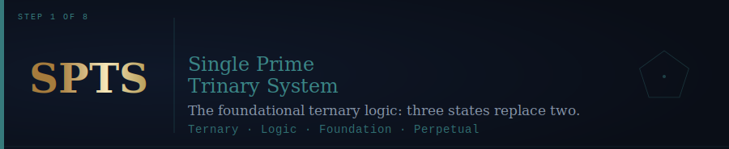

The foundational logic layer. SPTS encodes information using three irreducible states — **0 = Never, 1 = Constant, 2 = Always** — replacing binary's two with a more expressive, efficient, and perpetual ternary base. Every layer above SPTS is built on this foundation.

<br/>

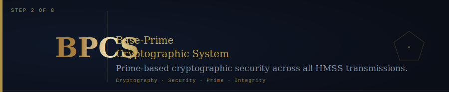

Built directly on SPTS ternary logic, BPCS uses prime-number mathematics to construct a cryptographic security framework across all HMSS transmissions. Integrity without compromise at every layer.

<br/>

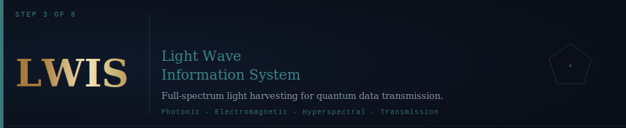

The transmission medium. LWIS harvests the full electromagnetic spectrum — from visible light to hyperspectral bands — enabling quantum-grade photonic data transfer. Light is not just the carrier; it is the language.

<br/>

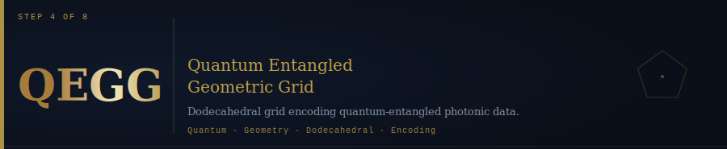

QEGG places a dodecahedral geometric grid over the LWIS transmission layer. QR-morphed pentagonal faces carry quantum-entangled photonic data, enabling self-replicating swarm architectures with ternary modulation.

<br/>

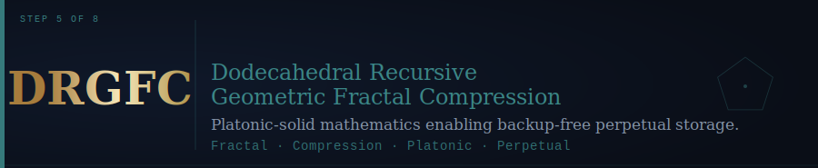

Where QEGG encodes, DRGFC compresses. Using the recursive fractal geometry of Platonic solids, DRGFC achieves scalable, stable, backup-free perpetual storage — compression that mirrors the self-returning paths of the dodecahedron itself.

<br/>

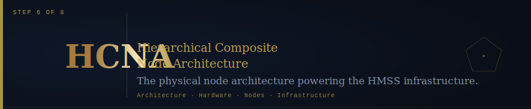

The physical infrastructure layer. HCNA defines the hierarchical node architecture that gives HMSS its physical form — composite nodes arranged to distribute, replicate, and sustain the entire system across real-world deployments.

<br/>

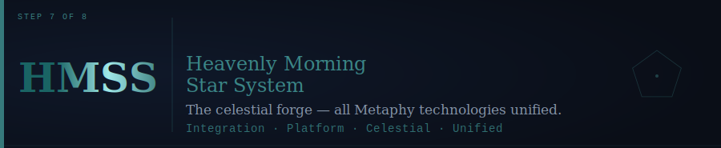

All six prior technologies converge here. HMSS is the integration platform — the celestial forge — that unifies SPTS, BPCS, LWIS, QEGG, DRGFC, and HCNA into a single, coherent, self-sustaining architecture for metaphysical computing.

<br/>

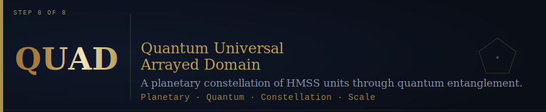

The final expression. QUAD is a planetary-scale network of HMSS units — a constellation, not a cloud — unified through quantum entanglement. Not infrastructure for the internet. Infrastructure *as* the universe intended it.

---

## ∞ &nbsp; Core Beliefs

*These are not corporate values. They are living principles — tested, revised, and forged through deliberate experimentation.*

<br/>

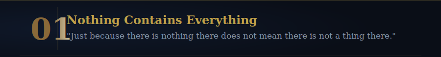
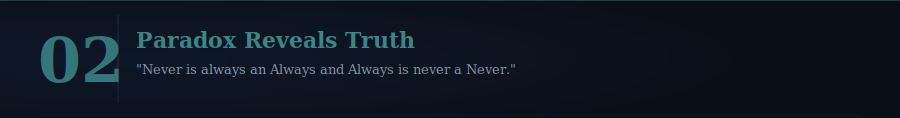
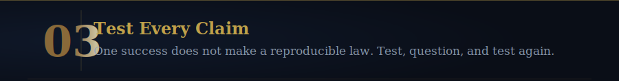
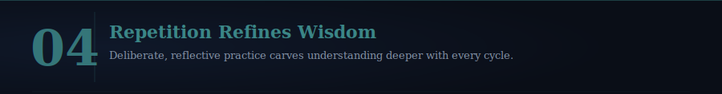
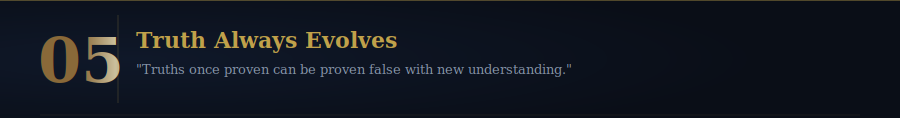
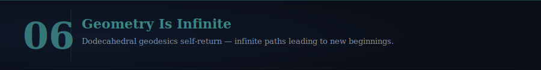

---

## ◈ &nbsp; Mission


---

## ◉ &nbsp; Connect

<div align="center">

**Randell Logan Smith** &nbsp;·&nbsp; *Founder and Inventor*

<br/>

[](https://metaphysicsandcomputing.com)
[](https://x.com/MetaphyKing)
[](mailto:Logan@MetaphysicsandComputing.com)

<br/>

*For collaborators. For investors. For fellow seekers of unseen truths.*

<br/><br/>

*What are you calling "nothing" right now that might actually be something profound?*

<br/>

---

<sub>⬡ &nbsp; Metaphy LLC &nbsp;·&nbsp; A Metaphy LLC Website &nbsp;·&nbsp; <a href="https://metaphysicsandcomputing.com">metaphysicsandcomputing.com</a> &nbsp;·&nbsp; © 2026</sub>

</div>